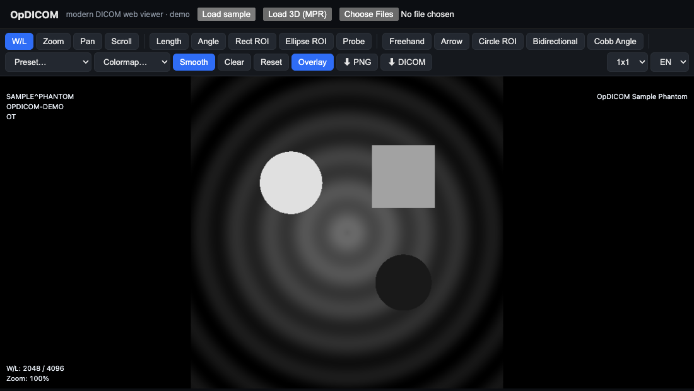
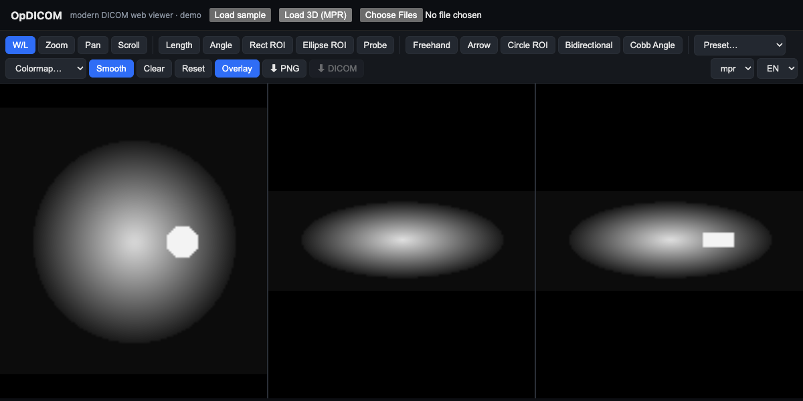

<div align="center">

# OpDICOM

### A modern, zero-footprint, framework-agnostic DICOM web viewer — plus a high-performance DICOM parser.

Built on [Cornerstone3D](https://www.cornerstonejs.org/) · TypeScript · Web Components · GPU rendering

[](./LICENSE)
[](https://www.npmjs.com/package/@opdicom/viewer)
[](https://github.com/TilsonF/opdicom/actions/workflows/ci.yml)
[](./CONTRIBUTING.md)

### [▶ Try the live demo](https://tilsonf.github.io/opdicom/)

<em>Open the demo and click <strong>Load sample</strong> (2D) or <strong>Load 3D (MPR)</strong> — no DICOM file needed.</em>

 

</div>

> ⚠️ **Not a medical device.** OpDICOM is open-source software for research, education
> and development. It is **not** cleared/approved for primary diagnosis. Do not use it as
> the sole basis for clinical decisions.

---

## Why OpDICOM?

Medical imaging on the web is powerful but hard to embed. OpDICOM is a thin, modern,
**embeddable** layer on top of the industry-standard rendering engine:

- 🧩 **One drop-in Web Component** — `<opdicom-viewer>` works in React, Vue, Angular, Svelte or plain HTML.
- ⚡ **GPU-accelerated** — pan/zoom, window/level, cine, measurements, MPR via Cornerstone3D.
- 📦 **Zero-footprint** — everything runs client-side. **Patient data never leaves the browser.**
- 🚀 **High-performance parser** — `@opdicom/parser` extracts metadata fast, streaming-friendly.
- 📱 **Multi-device** — phones, tablets, desktops, kiosks/TV. Touch gestures + keyboard.
- 🌍 **i18n** — English / Spanish out of the box, switchable at runtime.
- 🎨 **Customizable** — theming via CSS custom properties, configurable toolbar.
- 🔒 **Secure by design** — no telemetry, CSP-friendly, optional anonymization, audited deps.

## Install

```bash
npm i @opdicom/viewer          # the Web Component (works everywhere)
# framework wrappers (optional):
npm i @opdicom/react react
npm i @opdicom/vue vue
```

## Use it (60 seconds)

### Plain HTML / any framework

```html
<script type="module">
  import "@opdicom/viewer";
</script>

<opdicom-viewer id="v" style="width: 100%; height: 600px"></opdicom-viewer>

<script type="module">
  const viewer = document.getElementById("v");
  // File[] from an <input>/drag&drop, or DICOMweb (see below)
  await viewer.loadFiles(myFileList);
</script>
```

### React

```tsx
import { useRef } from "react";
import { OpdicomViewer, type OpdicomViewerHandle } from "@opdicom/react";

export function Study({ files }: { files: File[] }) {
  const ref = useRef<OpdicomViewerHandle>(null);
  return (
    <OpdicomViewer
      ref={ref}
      locale="en"
      layout="1x1"
      style={{ width: "100%", height: 600 }}
      onLoad={(d) => console.log("loaded", d.metadata)}
    />
  );
  // ref.current?.loadFiles(files)
}
```

### Vue / Angular

See **[docs/FRAMEWORKS.md](./docs/FRAMEWORKS.md)** (Angular uses the element directly via `CUSTOM_ELEMENTS_SCHEMA`).

### From a PACS / DICOMweb server

```js
await viewer.loadFromDicomWeb?.(
  { wadoRsRoot: "https://server/dicom-web", headers: { Authorization: "Bearer …" } },
  { studyInstanceUID: "1.2.…", seriesInstanceUID: "1.2.…" },
);
```

How devices/PACS/cloud connect → **[docs/CONNECTIVITY.md](./docs/CONNECTIVITY.md)**.

## What it can do

| Area | Features |
| --- | --- |
| **View** | Window/Level (+ CT presets), zoom, pan, invert, smoothing, photometric handling |
| **Navigate** | Stack scroll (wheel / keyboard), slice indicator, **cine** playback (play/pause/fps) |
| **Measure** | Length, angle, rectangle/ellipse ROI (area + pixel/HU stats), probe |
| **Annotate** | Freehand, arrow, circle ROI, bidirectional, Cobb angle |
| **Color** | Pseudo-color colormaps (Hot, Jet, Cool-to-Warm, Rainbow) |
| **Overlays** | Patient/study/series corners, W/L, zoom, slice, live cursor position + value |
| **Layouts** | 1×1 / 2×1 / 1×2 / 2×2 grids with synchronized zoom/pan/W-L/scroll |
| **MPR** | Axial / sagittal / coronal reconstruction from a volume |
| **Export** | PNG/JPEG (with burned-in annotations), download original DICOM |
| **Load** | Local files (drag & drop), DICOMweb (WADO-RS / QIDO-RS) |
| **i18n** | English / Spanish, runtime switch |

## Packages

| Package | Description |
| --- | --- |
| [`@opdicom/viewer`](./packages/viewer) | `<opdicom-viewer>` Web Component (Lit) — the easy way |
| [`@opdicom/core`](./packages/core) | Headless, framework-agnostic viewer engine over Cornerstone3D |
| [`@opdicom/parser`](./packages/parser) | High-performance DICOM metadata/tag parser |
| [`@opdicom/react`](./packages/react) | React wrapper |
| [`@opdicom/vue`](./packages/vue) | Vue 3 wrapper |

## Architecture

```
 <opdicom-viewer>  (Lit Web Component — framework-agnostic UI)
        │
   @opdicom/core   (headless engine: viewports, tools, layouts, MPR, export, DICOMweb)
        │
  Cornerstone3D    (GPU rendering, tools) + @opdicom/parser + WASM codecs (web workers)
```

A single core, wrapped by a Web Component, usable from any framework. Patient pixels
are decoded and rendered entirely in the browser.

## Develop

```bash
# Node >= 20, pnpm >= 10
pnpm install
pnpm dev            # demo playground (Vite)
pnpm test           # unit tests (Vitest)
pnpm test:e2e       # end-to-end (Playwright)
pnpm build          # build all packages
pnpm typecheck
```

Monorepo (pnpm workspaces): `packages/{parser,core,viewer,react,vue}` + `apps/demo`.

## Documentation

- [Framework usage (React / Vue / Angular)](./docs/FRAMEWORKS.md)
- [Connectivity — devices, PACS & DICOMweb](./docs/CONNECTIVITY.md)
- [Releasing & hosting](./docs/RELEASING.md)
- [Roadmap](./ROADMAP.md) · [Security policy](./SECURITY.md)

## Contributing

Contributions welcome! Read [CONTRIBUTING.md](./CONTRIBUTING.md) and the
[Code of Conduct](./CODE_OF_CONDUCT.md). Every change goes through a PR with CI
(typecheck, unit, E2E, CodeQL, dependency audit).

## License

[MIT](./LICENSE) © OpDICOM contributors. Built on the excellent
[Cornerstone3D](https://github.com/cornerstonejs/cornerstone3D) ecosystem.
